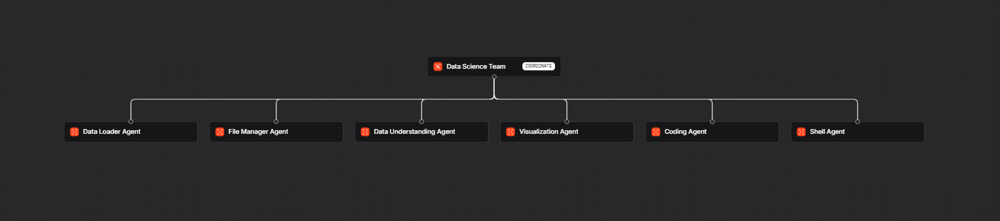

# DataPilot AI 🤖

> **Agentic AI for Data Science & Machine Learning Workflow Automation**



---

## 🚀 Overview

**DataPilot AI** is an agentic AI system built with **Agno** that uses a team of specialized AI agents to assist with data science and machine learning workflows.

Instead of depending on a single general-purpose AI agent, DataPilot AI divides responsibilities across specialized agents for:

- 📂 Data loading
- 🧠 Data understanding
- 📊 Data visualization
- 💻 Python and ML coding
- 📁 Project file management
- ⚙️ Project execution
- 🌐 Technical web search

The system is designed as a foundation for assisting and automating an end-to-end data science and machine learning workflow.

```text
Data Loading
     ↓
Data Understanding
     ↓
Exploratory Analysis
     ↓
Visualization
     ↓
Data Cleaning
     ↓
Feature Engineering
     ↓
Model Development
     ↓
Model Training
     ↓
Model Evaluation
```

> **Note:** The dataset currently included in this project is only a **sample dataset used for testing and demonstrating the agentic pipeline**. The architecture is designed to work with other compatible datasets as the project evolves.

---

# ✨ Key Features

- 🤖 Multi-agent data science architecture
- 🧠 Specialized AI agents for different workflow stages
- 📂 CSV dataset loading and exploration
- 🔎 Automated dataset understanding
- 🐼 Pandas DataFrame operations
- 📊 AI-assisted data visualization
- 💻 Python and ML code generation
- 🌐 Web search for technical research
- 🗂️ Project file management
- ⚙️ Controlled Python/project execution
- 🧠 SQLite-based session memory
- 👥 Multi-agent orchestration using Agno Teams
- 🚀 AgentOS application layer
- 🔌 FastAPI application interface through AgentOS
- 👨‍💻 Human-in-the-loop code review

---

# 🏗️ Architecture

DataPilot AI follows a **specialized multi-agent architecture**.

A central **Data Science Team** coordinates the specialized agents and delegates tasks according to their responsibilities.

```text
                              ┌───────────────────┐
                              │       USER        │
                              └─────────┬─────────┘
                                        │
                                        ▼
                              ┌───────────────────┐
                              │   DataPilot AI    │
                              │  Data Science Team│
                              └─────────┬─────────┘
                                        │
             ┌──────────────┬───────────┼───────────┬──────────────┐
             │              │           │           │              │
             ▼              ▼           ▼           ▼              ▼
      ┌────────────┐ ┌────────────┐ ┌────────┐ ┌────────────┐ ┌────────────┐
      │    Data    │ │    Data    │ │   Viz  │ │   Coding   │ │    File    │
      │   Loader   │ │Understanding│ │ Agent  │ │   Agent    │ │  Manager   │
      │   Agent    │ │   Agent    │ │        │ │            │ │   Agent    │
      └────────────┘ └────────────┘ └────────┘ └────────────┘ └────────────┘
             │              │           │           │              │
             └──────────────┴───────────┼───────────┴──────────────┘
                                        │
                                        ▼
                                ┌──────────────┐
                                │ Shell Agent  │
                                └──────┬───────┘
                                       │
                                       ▼
                         ┌───────────────────────────┐
                         │     Data Science Project  │
                         │                           │
                         │ CSV • Python • ML • Plots│
                         └───────────────────────────┘
```

A visual architecture diagram is also included in the repository:

```text
architecture.png
```

---

# 🤖 Multi-Agent System

DataPilot AI currently contains **six specialized agents** coordinated through an Agno `Team`.

| Agent | Responsibility | Main Tools |
|---|---|---|
| **Data Loader Agent** | Loads and explores CSV data | `CsvTools`, `FileTools` |
| **File Manager Agent** | Manages project files | `FileTools` |
| **Data Understanding Agent** | Performs Pandas-based data exploration | `PandasTools`, DataFrame tools, `FileTools` |
| **Visualization Agent** | Creates data visualizations | `VisualizationTools`, DataFrame tools, `FileTools` |
| **Coding Agent** | Generates Python and ML code | `PythonTools`, `DuckDuckGoTools`, `ShellTools` |
| **Shell Agent** | Inspects project and executes Python files | `ShellTools` |

---

# 👥 Data Science Team

The central orchestration layer is the **Data Science Team**.

```text
Data Loader Agent
        │
File Manager Agent
        │
Data Understanding Agent
        │
Visualization Agent
        │
Coding Agent
        │
Shell Agent
        │
        ▼
Data Science Team
```

The team is responsible for:

- Understanding user requests
- Delegating tasks to specialized agents
- Coordinating workflow stages
- Guiding users through the data science process
- Maintaining useful session context
- Handling debugging scenarios
- Assisting with ML workflow development

The team uses session state, agent history, member tools, and agentic state.

---

# 🔄 Agentic Workflow

A typical DataPilot AI workflow looks like:

```text
                       USER REQUEST
                            │
                            ▼
                  ┌──────────────────┐
                  │ Data Science Team│
                  └────────┬─────────┘
                           │
                           ▼
                   Task Understanding
                           │
            ┌──────────────┼──────────────┐
            │              │              │
            ▼              ▼              ▼
       Data Loading    Data Analysis   ML/Coding
            │              │              │
            ▼              ▼              ▼
       CSV Tools       Pandas Tools    Python Tools
            │              │              │
            └──────────────┼──────────────┘
                           │
                           ▼
                    Visualization
                           │
                           ▼
                  Pipeline Development
                           │
                           ▼
                      User Review
                           │
                           ▼
                 Execution / Iteration
```

The key concept is **agent delegation** instead of using one agent for every operation.

---

# 🧩 Agent Details

## 1. Data Loader Agent

The **Data Loader Agent** specializes in loading and inspecting CSV datasets.

### Responsibilities

- Locate CSV files
- List available data files
- Read CSV datasets
- Search project files
- Use dedicated CSV tools
- Avoid unnecessarily reading large portions of datasets

The project currently contains a **sample dataset** for demonstrating the pipeline.

### Tools

```text
CsvTools
FileTools
```

---

## 2. File Manager Agent

The **File Manager Agent** manages the project filesystem.

### Responsibilities

- List files
- Read files
- Write files when required
- Help understand project structure

This agent is intentionally separated from CSV processing.

### Tool

```text
FileTools
```

---

## 3. Data Understanding Agent

The **Data Understanding Agent** performs dataset exploration using Pandas.

It can perform operations such as:

```text
head
tail
info
describe
value_counts
shape
columns
dtypes
```

It can help identify:

- Numerical columns
- Categorical columns
- Dataset dimensions
- Data types
- Basic statistics
- Category distributions

### Example

```text
Show me the first 5 rows of the dataset.
```

```text
What are the columns and data types?
```

```text
What is the shape of the dataset?
```

```text
Show the value counts of a categorical column.
```

### Tools

```text
PandasTools
FileTools
Custom DataFrame functions
```

---

## 4. Visualization Agent

The **Visualization Agent** is responsible for creating data visualizations.

It supports:

- Bar plots
- Pie charts
- Line plots
- Histograms
- Scatter plots

| Analysis | Visualization |
|---|---|
| Categorical comparison | Bar chart |
| Categorical proportion | Pie chart |
| Numerical distribution | Histogram |
| Two numerical variables | Scatter plot |
| Ordered/time-based data | Line chart |

The agent verifies that the requested DataFrame and columns exist before creating visualizations.

### Tools

```text
VisualizationTools
FileTools
Custom DataFrame creation tools
Custom DataFrame operation tools
```

---

## 5. Coding Agent

The **Coding Agent** is responsible for Python and machine learning development.

It can assist with:

- Python programming
- Data cleaning
- Feature engineering
- Machine learning model development
- Model training
- Model evaluation
- Data science experimentation

The agent can work with libraries such as:

```text
pandas
numpy
scikit-learn
scipy
```

It also has web-search capability when technical documentation or additional information is required.

### Human-in-the-loop workflow

```text
Generate Code
     ↓
User Reviews Code
     ↓
Save / Execute
```

This prevents the system from automatically saving and executing every generated ML workflow.

### Tools

```text
PythonTools
DuckDuckGoTools
ShellTools
```

---

## 6. Shell Agent

The **Shell Agent** provides controlled project execution.

### Responsibilities

- Inspect project structure
- Read project files
- Run Python files
- Help investigate execution errors

The agent is instructed to use:

```bash
uv run <python_file.py>
```

for Python execution.

### Tool

```text
ShellTools
```

---

# 🛠️ Technology Stack

## Core Technologies

| Technology | Purpose |
|---|---|
| **Python** | Core programming language |
| **Agno** | Agentic AI framework |
| **Groq** | LLM provider |
| **openai/gpt-oss-120b** | LLM used by agents |
| **Pandas** | Data analysis |
| **Matplotlib / VisualizationTools** | Data visualization |
| **SQLite** | Session and memory storage |
| **AgentOS** | Agent application layer |
| **FastAPI** | Application interface through AgentOS |
| **python-dotenv** | Environment variable management |
| **uv** | Python environment and dependency management |
| **DuckDuckGo** | Web search |
| **NumPy** | Numerical computing / ML code |
| **scikit-learn** | Machine learning |
| **SciPy** | Scientific computing |

---

# 🧠 Agno Components Used

The project uses the following Agno components:

```python
Agent
Team
AgentOS
SqliteDb
```

These components provide:

- Individual AI agents
- Multi-agent collaboration
- Agent orchestration
- Session memory
- Agentic state
- Application runtime

---

# 🔧 Tools Used

## CsvTools

Used by the Data Loader Agent for CSV loading and inspection.

```python
from agno.tools.csv_toolkit import CsvTools
```

---

## FileTools

Used for project filesystem operations.

```python
from agno.tools.file import FileTools
```

Used by:

- Data Loader Agent
- File Manager Agent
- Data Understanding Agent
- Visualization Agent

---

## PandasTools

Used for DataFrame creation and operations.

```python
from agno.tools.pandas import PandasTools
```

Configured with:

```python
PandasTools(
    enable_create_pandas_dataframe=True,
    enable_run_dataframe_operation=True
)
```

---

## VisualizationTools

Used by the Visualization Agent.

```python
from agno.tools.visualization import VisualizationTools
```

Visualizations are generated in the project visualization workspace.

---

## DuckDuckGoTools

Used by the Coding Agent for web search.

```python
from agno.tools.duckduckgo import DuckDuckGoTools
```

---

## PythonTools

Used by the Coding Agent for Python development.

```python
from agno.tools.python import PythonTools
```

---

## ShellTools

Used by the Coding Agent and Shell Agent for controlled shell operations.

```python
from agno.tools.shell import ShellTools
```

---

# 🤖 LLM Configuration

DataPilot AI uses **Groq** for LLM inference.

### Model

```text
openai/gpt-oss-120b
```

The model is configured through Agno:

```python
Groq(
    id="openai/gpt-oss-120b",
    api_key=...
)
```

The project uses separate API key configuration for individual agents and the team model.

```env
GROQ_API_KEY=your_groq_api_key
GROQ_API_KEY2=your_second_groq_api_key
```

---

# 🧠 Memory & Session Management

DataPilot AI uses Agno's SQLite database integration:

```python
SqliteDb(
    db_file="memory.db",
    session_table="session_table"
)
```

The system uses session context and agentic state to maintain useful workflow information.

The Data Science Team is configured with:

```text
add_history_to_context
num_history_runs
read_chat_history
session_state
add_session_state_to_context
enable_agentic_state
```

---

# 🚀 AgentOS Integration

DataPilot AI uses **Agno AgentOS** as the application layer.

The Data Science Team is registered with AgentOS:

```python
agent_os = AgentOS(
    id="agent-os",
    name="Data Science Team",
    description="This team of agent helps you throughout your data science and ML pipeline journey",
    teams=[data_science_team]
)
```

The application is then created using:

```python
app = agent_os.get_app()
```

This provides the application interface for the agentic system.

---

# 📊 Current Pipeline Coverage

| Pipeline Stage | Current Support |
|---|---|
| Dataset loading | ✅ Data Loader Agent |
| File discovery | ✅ Data Loader / File Manager |
| Data understanding | ✅ Data Understanding Agent |
| DataFrame operations | ✅ PandasTools |
| Exploratory analysis | ✅ Agent-assisted |
| Visualization | ✅ Visualization Agent |
| Data cleaning | 🟡 Coding Agent assisted |
| Feature engineering | 🟡 Coding Agent assisted |
| Model development | 🟡 Coding Agent assisted |
| Model training | 🟡 Coding Agent assisted |
| Model evaluation | 🟡 Coding Agent assisted |
| Automated model selection | 🔜 Future scope |
| Dedicated ML pipeline agents | 🔜 Future scope |
| Deployment automation | 🔜 Future scope |

### Legend

```text
✅ Implemented directly
🟡 Supported through AI-generated code / agent assistance
🔜 Planned future enhancement
```

---

# 📁 Project Structure

```text
Agno-datascience/
│
├── data/
│   └── sample dataset
│
├── plots/
│   └── generated visualizations
│
├── src/
│   └── source files
│
├── .env
├── .gitignore
├── .python-version
├── app.py
├── main.py
├── memory.db
├── pyproject.toml
├── requirements.txt
├── uv.lock
├── README.md
└── architecture.png
```

> The included dataset is a **sample dataset for development and demonstration**. The project is not tied to any particular dataset or domain.

---

# 🚀 Getting Started

## 1. Clone the repository

```bash
git clone <your-repository-url>
cd Agno-datascience
```

---

## 2. Install dependencies

Using `uv`:

```bash
uv sync
```

Or using `requirements.txt`:

```bash
pip install -r requirements.txt
```

---

## 3. Configure environment variables

Create a `.env` file in the project root:

```env
GROQ_API_KEY=your_groq_api_key
GROQ_API_KEY2=your_second_groq_api_key
```

The application loads environment variables using:

```python
from dotenv import load_dotenv

load_dotenv()
```

### ⚠️ Important

Never commit your API keys to GitHub.

Make sure `.env` is included in `.gitignore`.

---

# 📂 Dataset

The repository contains a **sample dataset** only for demonstrating and testing the DataPilot AI workflow.

The dataset is not the main focus of the project.

The architecture is designed so that the system can be extended to work with different datasets and data science problems.

To use another CSV dataset:

```text
data/
    └── your_dataset.csv
```

Then update the configured data path when required.

---

# ▶️ Running the Project

Run the application using your configured Python/uv environment.

```bash
uv run app.py
```

The application creates the AgentOS application from the Data Science Team.

---

# 💬 Example Prompts

Once DataPilot AI is running, users can interact with it using natural language.

### Dataset Understanding

```text
Analyze the dataset and tell me its shape, columns, data types,
and numerical and categorical columns.
```

### Data Exploration

```text
Show me the first 10 rows of the dataset.
```

### Statistical Analysis

```text
Give me descriptive statistics for the numerical columns.
```

### Categorical Analysis

```text
Show the value counts for a categorical column.
```

### Visualization

```text
Create a suitable visualization for the distribution of a categorical column.
```

### Feature Engineering

```text
Suggest and write Python code for feature engineering.
```

### Machine Learning

```text
Prepare a machine learning workflow for this dataset.
```

### Model Training

```text
Write Python code to train and evaluate a suitable machine learning model.
```

### Project Inspection

```text
Show me the files in the project.
```

### Debugging

```text
Run the Python file and help me debug the error.
```

---

# 🔐 Engineering & Control Mechanisms

DataPilot AI contains several design rules to keep agent behavior controlled.

### Specialized tool access

Each agent receives tools according to its responsibility.

```text
Data Agent       → Data Tools
Visualization    → Visualization Tools
Coding Agent     → Python + Search + Shell
File Manager     → File Tools
Shell Agent      → Shell Tools
```

### CSV isolation

CSV reading is delegated to the Data Loader Agent using `CsvTools`.

### DataFrame control

DataFrame creation and operations are handled through dedicated wrapper functions.

### Human approval

Generated ML code should be reviewed by the user before being saved and executed.

### Controlled shell execution

The Shell Agent is designed for project inspection and Python execution rather than destructive filesystem operations.

---

# 🎯 Project Objective

The objective of DataPilot AI is to explore how **Agentic AI can automate and coordinate practical data science and machine learning workflows**.

Traditional data science workflows often require manually switching between:

```text
Dataset
   ↓
Python / Pandas
   ↓
EDA
   ↓
Visualization
   ↓
Feature Engineering
   ↓
ML Code
   ↓
Training
   ↓
Evaluation
```

DataPilot AI introduces an agentic layer over this workflow:

```text
                    User
                     ↓
                DataPilot AI
                     ↓
              Data Science Team
                     ↓
       ┌─────────────┼─────────────┐
       ↓             ↓             ↓
     Data          Analysis        ML
     Agents         Agents        Agent
       └─────────────┼─────────────┘
                     ↓
              Data Science
                Workflow
```

The goal is to move toward a system where users can collaborate with a **team of AI agents** instead of manually coordinating every stage.

---

# 🌟 What Makes DataPilot AI Agentic?

DataPilot AI is not designed as a simple chatbot that only generates Python code.

The project uses:

### 1. Specialized Agents

Different agents have different responsibilities.

### 2. Tool Calling

Agents interact with:

- CSV files
- Pandas DataFrames
- Python
- Visualization tools
- Project files
- Shell
- Web search

### 3. Agent Delegation

The Data Science Team delegates tasks to the appropriate agent.

### 4. Shared Context

Session history and state help maintain workflow context.

### 5. Human-in-the-loop

The Coding Agent is designed to get code reviewed before saving and executing it.

### 6. Extensible Architecture

Additional agents can be added as the project grows.

---

# 📈 Current vs Future Architecture

## Current

```text
                  DataPilot AI
                       │
                       ▼
              Data Science Team
                       │
       ┌───────────────┼────────────────┐
       │       │       │       │        │
       ▼       ▼       ▼       ▼        ▼
      Data    Data    Viz    Coding    File/
     Loader   Under.  Agent   Agent    Shell
```

## Future

```text
                       DataPilot AI
                            │
                            ▼
                    Master Data Science
                         Team Agent
                            │
        ┌───────────────────┼──────────────────┐
        │                   │                  │
        ▼                   ▼                  ▼
   Data Pipeline       ML Pipeline       Evaluation
       Team                Team              Team
        │                   │                  │
   ┌────┴────┐        ┌────┴────┐       ┌────┴────┐
   ▼         ▼        ▼         ▼       ▼         ▼
 Loading   Cleaning  Feature   Training Metrics  Model
                    Engineer             & Eval   Selection
```

---

# 🔮 Future Scope

The current architecture provides a foundation for a larger autonomous ML workflow.

Planned enhancements include:

- [ ] Dedicated Data Cleaning Agent
- [ ] Dedicated Feature Engineering Agent
- [ ] Dedicated ML Training Agent
- [ ] Dedicated Model Evaluation Agent
- [ ] Automated model comparison
- [ ] Automated model selection
- [ ] Hyperparameter optimization
- [ ] Experiment tracking
- [ ] Dataset versioning
- [ ] Automated EDA reports
- [ ] Automated ML reports
- [ ] Model artifact management
- [ ] Model deployment agent
- [ ] API deployment
- [ ] Model monitoring
- [ ] Pipeline visualization
- [ ] Additional data-source connectors
- [ ] Human approval checkpoints for critical pipeline stages

---

# 📌 Project Highlights

## Agentic AI

- Multi-agent collaboration
- Agno Team orchestration
- Specialized tool-enabled agents
- Agentic state
- Session memory
- Human-in-the-loop workflow

## Data Science

- CSV data loading
- Pandas DataFrame analysis
- Dataset profiling
- Numerical and categorical analysis
- Data visualization
- Python-based ML workflow generation

## Engineering

- Modular agent architecture
- SQLite-backed session storage
- AgentOS application layer
- FastAPI application interface
- `uv` dependency management
- Environment-based API configuration
- Controlled shell execution

---

# 💡 Why This Project?

Data science workflows involve multiple tools, libraries, files, and development stages.

DataPilot AI explores an alternative approach:

```text
Instead of:

User
 ↓
Manually perform every data science step
 ↓
Switch between tools
 ↓
Write code
 ↓
Debug
 ↓
Analyze
 ↓
Repeat


DataPilot AI:

User
 ↓
Data Science Team
 ↓
Specialized AI Agents
 ↓
Tool Calling + Delegation
 ↓
Data Science Workflow
 ↓
User Review
 ↓
Result
```

The project demonstrates how **Agentic AI can coordinate specialized capabilities instead of relying on a single AI model to perform every task.**

---

# 🏁 Conclusion

**DataPilot AI** demonstrates a practical implementation of **Agentic AI for data science and machine learning workflows**.

By combining:

```text
Agno
+
Groq
+
openai/gpt-oss-120b
+
Specialized Agents
+
Agno Tools
+
Pandas
+
Visualization
+
Python
+
SQLite
+
AgentOS
+
FastAPI
```

the project provides a foundation for an AI system that can:

- Understand datasets
- Delegate analytical tasks
- Perform DataFrame operations
- Generate visualizations
- Generate ML code
- Manage project files
- Execute Python workflows
- Maintain session context
- Coordinate a broader data science pipeline

The included dataset is intentionally only a **sample dataset for testing and demonstration**.

The primary focus of DataPilot AI is its **agentic architecture, multi-agent orchestration, tool integration, workflow automation, and extensibility toward automated machine learning pipelines.**

---

# ⭐ Vision

> **From asking AI to write data-science code → to collaborating with an AI team that understands, coordinates, and assists throughout the data science lifecycle.**

---

# 👨‍💻 Author

**Krishna Tiwari**

AI Developer | Machine Learning | Agentic AI

---
